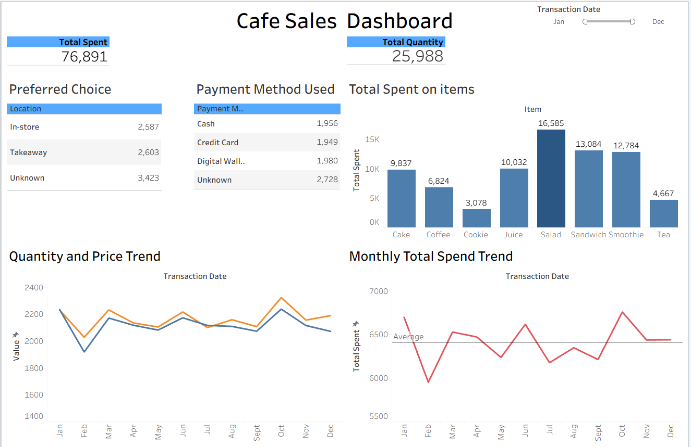

# ☕ Cafe Sales Dashboard

## Overview
The **Cafe Sales Dashboard** provides an interactive visual analysis of café transaction data, enabling quick insights into sales performance, customer preferences, and payment behavior. The dashboard helps identify key trends in revenue, product performance, and monthly spending patterns.

This project demonstrates **data cleaning, transformation, and visualization skills** using transactional sales data.

---

## Dashboard Preview

---

# Objectives

The main objectives of this dashboard are to:

- Monitor **overall sales performance**
- Track **total quantity of items sold**
- Identify **top-performing products**
- Analyze **customer purchasing preferences**
- Examine **payment method usage**
- Understand **monthly spending trends**

---

# Key Metrics

## 1. Total Spent
Displays the **total revenue generated** during the selected period.

**Current value:**  
**76,891**

---

## 2. Total Quantity
Shows the **total number of items sold** across all transactions.

**Current value:**  
**25,988**

---

# Dashboard Components

## 1. Preferred Choice

Shows where customers prefer to consume their purchases.

| Location | Transactions |
|--------|--------|
| In-store | 2,587 |
| Takeaway | 2,603 |
| Unknown | 3,423 |

This helps understand **customer behavior and service preferences**.

---

## 2. Payment Method Used

Breakdown of payment methods customers used.

| Payment Method | Count |
|------|------|
| Cash | 1,956 |
| Credit Card | 1,949 |
| Digital Wallet | 1,980 |
| Unknown | 2,728 |

This insight can help guide **payment infrastructure improvements**.

---

## 3. Total Spent on Items

Displays the **total revenue generated per product category**.

| Item | Total Spent |
|------|-------------|
| Salad | 16,585 |
| Sandwich | 13,084 |
| Smoothie | 12,784 |
| Juice | 10,032 |
| Cake | 9,837 |
| Coffee | 6,824 |
| Tea | 4,667 |
| Cookie | 3,078 |

**Key Insight:**  
Salads generate the highest revenue among all items.

---

## 4. Quantity and Price Trend

Tracks how **quantity sold and price trends change throughout the year**.

Insights include:

- Seasonal fluctuations in sales
- Relationship between quantity and price movements
- Identifying high-demand periods

---

## 5. Monthly Total Spend Trend

Shows **monthly sales performance** across the year.

Key insights:

- Detect **high and low sales months**
- Compare monthly spending against the **average sales line**
- Identify seasonal demand patterns

---

# Filters

## Transaction Date Slider

Users can dynamically filter the dashboard by selecting a **specific time range**.

This allows for:

- Period comparisons
- Seasonal trend analysis
- Focused performance review

---

# Key Insights

From the dashboard analysis:

- **Salads, sandwiches, and smoothies generate the most revenue**
- **Takeaway orders slightly exceed in-store purchases**
- **Digital wallets and credit cards are nearly as popular as cash**
- **Monthly sales fluctuate but remain relatively stable around the average**

---

# Dataset Description

The dataset contains **10,000 café transactions** with the following fields:

| Column | Description |
|------|-------------|
| transaction_id | Unique transaction identifier |
| item | Product purchased |
| quantity | Number of items purchased |
| price_per_unit | Price of a single item |
| total_spent | Total transaction amount |
| payment_method | Payment type used |
| location | In-store or takeaway |
| transaction_date | Date of purchase |

---

# Data Cleaning Process

The dataset required preprocessing before visualization:

- Handling **missing values** (`unknown`, `error`, blanks)
- Converting **transaction_date** to datetime
- Verifying **total_spent = quantity × price_per_unit**
- Identifying **outliers**
- Standardizing **categorical values**

---

# Tools Used

- **Python (Pandas)** – Data cleaning and transformation  
- **Tableau / Power BI** – Dashboard visualization  
- **Excel / CSV** – Data storage  
- **GitHub** – Version control and project sharing  

---

# Project Skills Demonstrated

- Data Cleaning
- Data Validation
- Exploratory Data Analysis (EDA)
- Data Visualization
- Business Insight Generation
- Dashboard Design

---

